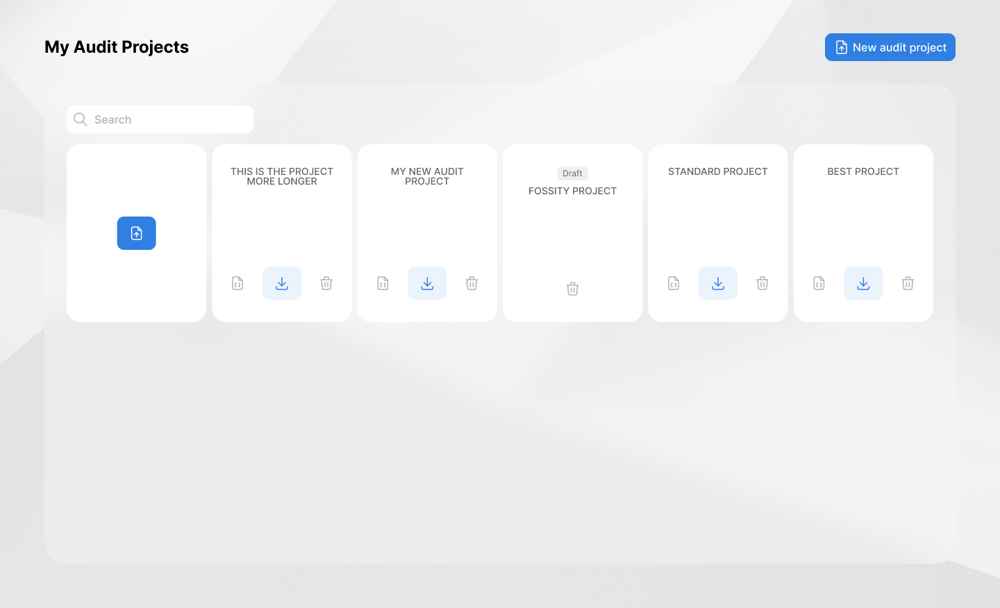

# [FOSSITY PROBE](https://fossity.com)

<div>


</div>

Fossity's Decentralized Open Source Auditing Platform offers efficient and confidential audits for M&A due diligence and product developers. The innovative decentralized approach provides scalability, reliability, and eliminates human error.


Fossity Probe is a cross-platform app that runs on Windows, MacOS, and Linux. It is fully open source and designed to be simple and straightforward to use.

The Fossity Probe captures basic information and fingerprints from your code. These fingerprints provide auditors with the information they need to perform your audit, without requiring the transfer of any sensitive information from your code or company.
<div align="center">
  
</div>

## Prerequisites

- Node.js v14+
- NPM (Node Packages Manager)

We strongly recommend handling your node versions using [nvm](https://github.com/nvm-sh/nvm)

## Install
# [FOSSITY PROBE](https://fossity.com)

```bash
npm install
```

### Troubleshooting

Fossity Probe uses [node-gyp](https://www.npmjs.com/package/node-gyp) to compile SQLite3 native module.
This module uses "node-pre-gyp" to download the prebuilt binary for your platform instead you need build from source.
In case it does not exist for your platform, node-gyp going to build it.

Depending on your operating system, you will need prepare the correct environment to run node-gyp: See [https://github.com/nodejs/node-gyp#installation](https://github.com/nodejs/node-gyp#installation)

## Starting Development

Start the app in the `dev` environment:

```bash
npm start
```

For live reloading you can use `npm run start --watch` to run the app using [Electronmon](https://github.com/catdad/electronmon#readme). Warning: this tool has a high memory consumption.

## Packaging for Production

To package apps for the local platform:

```bash
npm run package
```

## Multi-language (i18n)

Fossity Probe is multi-language enabled. To contribute a new language please see our [internationalization documentation](assets/i18n/README.md).

## Proxy Configuration
Fossity Probe support proxy settings, you might need to specify proxy settings depending on how your network is configured

All the configurations needs to be included in the workspace config file `~/scanoss-workspace/workspaceCfg.json`

`"PROXY": "<proxy_ip_address>:<proxy_port>"`

If your network is using a proxy with SSL interception you can include your certificate in the configuration

`  "CA_CERT": "<certificate_path>"`


You can disable any SSL errors, to do so you can change this option to true

`"IGNORE_CERT_ERRORS:"true"`

## Contributing

Fossity Probe is an open source project, and we love to receive contributions from our community. There are many ways to contribute. For more information see the [Contributing Guide](CONTRIBUTING.md) and [Code of Conduct](CODE_OF_CONDUCT.md).

## Docs

This project was made using Electron React Boilerplate

See [docs and guides here](https://electron-react-boilerplate.js.org/docs/installation)

Forked from SCANOSS Audit Workbench
